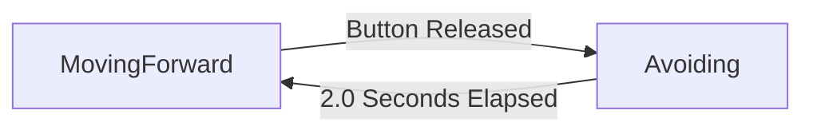

# CircuitPython Finite State Machine Documentation

This document describes the implementation of a non-blocking robot behavior controller using a custom `simple_fsm` library. The example code manages two distinct behaviors: **Moving Forward** (with a status light blink) and **Avoiding** (a timed wait state).

## 1. The `simple_fsm.py` Library Guide

The `simple_fsm` library provides a lightweight framework for managing state transitions without blocking the main program loop. It consists of two main classes: `State` and `StateMachine`.

### How to use the Library

Install `simple_fsm.py` and `test_fsm.py` in the root directory.

Run `test_fsm.py`

1. **Define States:** Create a new class for every distinct behavior (e.g., `Idle`, `Run`, `Error`) inheriting from `State`.
2. **Override Methods:** Inside your state classes, override the following methods to define behavior:
* `enter(self)`: Runs **once** when the state starts. Use this for setup (turning on lights, resetting timers).
* `exit(self)`: Runs **once** just before the state ends. Use this for cleanup (turning off motors).
* `update(self)`: Runs **continuously** in the main loop. Use this for checking timers or sensor thresholds.
* `on_event(self, event)`: Runs only when a hardware event occurs (like a button press). Use this for manual triggers.


3. **Initialize:** Create an instance of `StateMachine`.
4. **Inject Dependencies:** When transitioning, pass the machine instance into the State:
```python
# The state needs 'self.machine' to trigger future transitions
self.machine.transition_to(NewState(self.machine))

```


---

## 2. Hardware Configuration

The code works with the **CRCibernetica IdeaBoard**

* **RGB LED:** Accessed via `ib.pixel`. Used to visually indicate the current state and activity.
* **BOOT Button:** Connected to `board.IO0`. Press and release the button to transition to the Avoiding state.


---

## 3. State Flow Diagram

The system toggles between two states based on specific triggers:



---

## 4. Class Descriptions (for test_fsm.py example code)

### Class: `MovingForward(State)`

This is the default state of the robot. It simulates normal operation where the robot is active.

**Key Feature: Non-Blocking Blink**
Unlike a standard `time.sleep()` blink, this state uses timestamps to blink the LED while still listening for button inputs.

* **`enter()`**:
  * Logs the state change.
  * Initializes `self.pixel_state` (boolean) to track if the LED is on or off.
  * Captures `self.start_time` using `time.monotonic()` to begin the blink timer.


* **`update()`**:
  * Checks if **0.5 seconds** have passed since the last toggle.
  * If yes: Toggles the LED (Green ON/OFF) and resets the timestamp.
  * *Visual Output:* Blinking Green.


* **`on_event(event)`**:
  * Listens for the button to be **released**.
  * **Action:** Transitions the machine to the `Avoiding` state.


### Class: `Avoiding(State)`

This state represents a reaction to an obstacle. It pauses normal operation for a fixed duration.

**Key Feature: Non-Blocking Delay**
The robot waits for 2 seconds, but the main loop continues running. This ensures the robot remains responsive (e.g., if you added an emergency stop button, it would still work during this wait).

* **`enter()`**:
  * Logs the state change.
  * Sets the LED to **Solid Blue** (indicating an obstacle/wait).
  * Captures `self.start_time` to track the duration of the avoidance maneuver.


* **`update()`**:
  * Continuously calculates `current_time - self.start_time`.
  * Checks if the difference is greater than **2.0 seconds**.
  * **Action:** If time is up, it transitions back to `MovingForward`.


* **`on_event(event)`**:
  * *None defined.* Button presses are ignored during the avoidance maneuver.


---

## 5. Main Execution Loop

The `while True:` loop is the engine that drives the non-blocking logic.

1. **Event Polling:** `buttons.events.get()` checks if a hardware interrupt occurred.
2. **Event Handling:**
* If an event happened, it is passed to `robot_fsm.handle_event(event)`.
* The *current* state decides what to do with that button press.


3. **Continuous Updates:**
* `robot_fsm.update()` is called every cycle.
* This drives the blinking logic in `MovingForward` and the timer logic in `Avoiding`.
